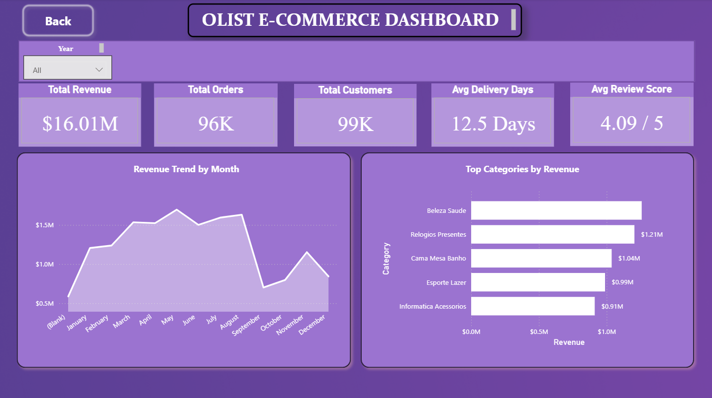
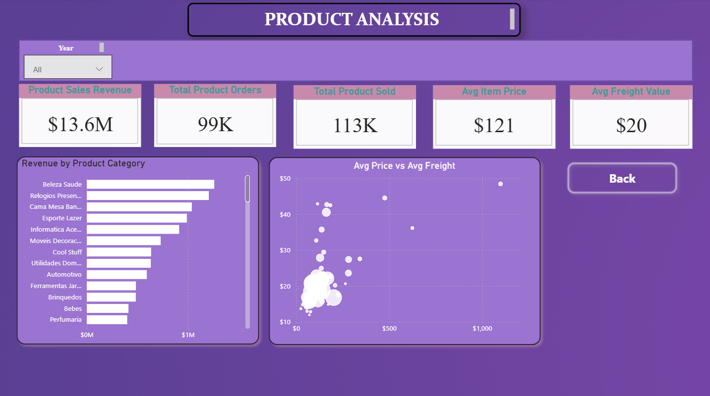
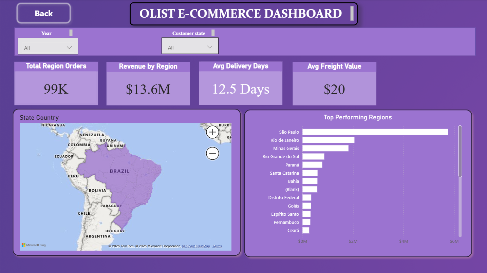
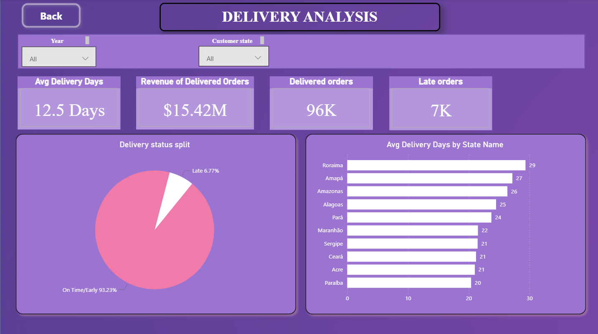
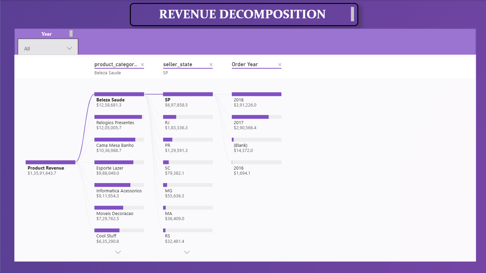

# Olist E-commerce Dashboard

## 📊 Project Overview

The **Olist E-commerce Dashboard** is an interactive Power BI project designed to analyze e-commerce sales performance, product performance, customer regions, and delivery operations.

The dashboard transforms e-commerce data into interactive visualizations and KPIs that help understand revenue trends, orders, customers, products, geographic performance, and delivery status.

---

## 🎯 Project Objectives

* Analyze overall e-commerce sales performance
* Track revenue and order trends over time
* Identify high-performing product categories
* Analyze product sales and pricing
* Compare revenue across Brazilian states
* Analyze delivery performance and late orders
* Understand delivery status distribution
* Explore revenue using a decomposition tree
* Provide interactive filtering for business analysis

---

## 🛠️ Tools & Technologies

* **Power BI**
* **Power Query**
* **DAX**
* **Data Modeling**
* **Interactive Visualizations**
* **Bookmarks**
* **Tooltips**
* **Slicers**
* **Decomposition Tree**

---

## 📌 Dashboard Pages

### 1. Executive Dashboard

Provides a high-level overview of the business with important KPIs and trends.

**Key metrics include:**

* Total Revenue
* Total Orders
* Total Customers
* Delivery Days
* Average Review

**Visualizations include:**

* Monthly Revenue Trend
* Top Categories by Revenue
* Year Filter

---

### 2. Product Analysis

Provides detailed analysis of product performance.

**KPIs include:**

* Product Revenue
* Total Product Orders
* Total Products Sold
* Average Item Price
* Average Freight Value

The page also includes category-level analysis and a scatter chart for analyzing relationships between product pricing and freight value.

---

### 3. Region Analysis

Analyzes e-commerce performance across customer locations.

**Features include:**

* Revenue by state
* Product orders by region
* Product revenue by region
* Average delivery days
* Average freight value
* Geographic map visualization
* Customer-state filtering

---

### 4. Delivery Analysis

Focuses on delivery performance and order fulfillment.

**KPIs include:**

* Delivery Days
* Delivered Revenue
* Delivered Orders
* Late Orders

The dashboard also provides:

* Delivery Status distribution
* State-level delivery analysis
* Customer-state filtering
* Year filtering

---

### 5. Revenue Decomposition

The decomposition tree provides an interactive way to break down product revenue across different dimensions.

This allows users to explore the factors contributing to overall revenue.

---

## 📈 Key KPIs

The dashboard displays important business metrics including:

| KPI                   | Description                     |
| --------------------- | ------------------------------- |
| Total Revenue         | Overall revenue generated       |
| Total Orders          | Total number of orders          |
| Total Customers       | Number of customers             |
| Product Revenue       | Revenue generated from products |
| Products Sold         | Total products sold             |
| Average Item Price    | Average price of products       |
| Average Freight Value | Average freight/shipping value  |
| Delivery Days         | Delivery performance metric     |
| Delivered Orders      | Number of delivered orders      |
| Late Orders           | Number of late orders           |
| Average Review        | Average customer review metric  |

---

## 🔍 Key Dashboard Features

### Interactive Filtering

Users can filter the dashboard by:

* Year
* Customer State

### Navigation

Navigation buttons allow users to move between different dashboard sections.

### Tooltips

Additional information can be displayed through interactive tooltip pages.

### Bookmarks

Bookmarks are used to improve dashboard navigation and provide an interactive user experience.

### Decomposition Tree

The decomposition tree allows revenue to be explored across multiple dimensions.

---

## 🖼️ Dashboard Preview

### Executive Dashboard



### Product Analysis



### Region Analysis



### Delivery Analysis



### Revenue Decomposition



---

## 📂 Repository Structure

```text
olist-ecommerce-powerbi-dashboard/
│
├── README.md
│
├── Olist E-commerce Dashboard.pbix
│
├── Screenshots/
│   ├── executive-dashboard.png
│   ├── product-analysis.png
│   ├── region-analysis.png
│   ├── delivery-analysis.png
│   └── revenue-decomposition.png
│
└── Documentation/
    └── project-overview.md
```

---

## 💡 Skills Demonstrated

This project demonstrates practical skills in:

* Power BI Dashboard Development
* Data Visualization
* Data Analysis
* Power Query
* DAX Measures
* Data Modeling
* KPI Development
* Interactive Dashboard Design
* Business Intelligence
* Geographic Analysis
* Product Analysis
* Delivery Performance Analysis
* Data Storytelling

---

## 🚀 How to Use

1. Download the `.pbix` file from this repository.
2. Open it using **Microsoft Power BI Desktop**.
3. Use the available slicers and navigation buttons to explore the dashboard.
4. Interact with the visualizations to analyze different aspects of the e-commerce business.

---

## 📌 Project Type

**Business Intelligence / Data Analytics / Power BI**

---

## 👨‍💻 Author

**Vicky V. Ingle**

GitHub: [github.com/mrvickyingle](https://github.com/mrvickyingle)

LinkedIn: [linkedin.com/in/vicky-ingle-396212436](https://linkedin.com/in/vicky-ingle-396212436)
